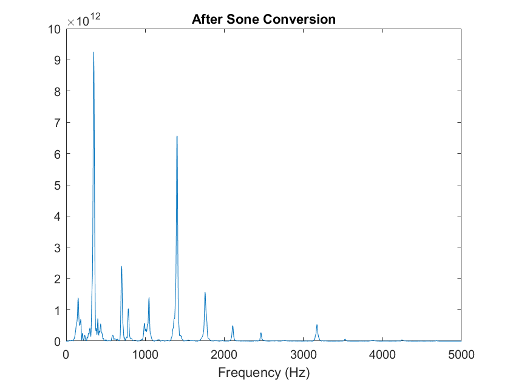

# Melody Extractor
Extract melody from an audio file.
```
Usage:
melody_extractor('audio.mp3','add_neighbor_octaves',[],0,20000,-1,0,true)
```

## Main Flow:

### 1. Signal Segmentation
The script takes 25 msec segments of the input audio file at a time. For each segment, a Hamming window is applied. At each iteration, the sliding window shifts by 10% of the segment size (i.e. 2.5 msec worth of signal).

### 2. FFT
FFT is applied to the windowed signal.

### 3. Dominant Note Analysis
To account for human ear's tendency to perceive higher notes 'louder' even if they are the same amplitude, the amplitude information provided by the FFT is first being converted to 'phon' (refer to https://en.wikipedia.org/wiki/Phon) then to 'sone' (https://en.wikipedia.org/wiki/Sone). Amplitude to phon conversion is defined via experimental result (usually defined by equal-loudness contours such as the one below, from Wikipedia), and there is clear equation that maps frequency and signal amplitude to phon. For this project, this conversion is approximated via Least Squares (refer to phonLSQ.m for details).




After FFT information is converted to phon, it is converted to sone using the following equation:


After sone conversion is complete, they are grouped by corresponding note frequencies, and a note with the largest sone total is deemed to be the 'melody element.'


### 4. Construct the output signal
After the most dominant note is determined, the output signal is constructed using all frequencies corresponding to that note, as well as other frequencies corresponding to the notes specified in the 'extraction_type' argument. Valid 'extraction_type' include:
- add_all_octaves: add all octaves of the dominant note
- add_all_lower_octaves: add all lower octaves of the dominant note that
- add_only_one_note: only add the dominant note
- add_neighbor_octaves: add one octave higher/lower than the dominant note (and the dominant note itself)


## Result

## melody_extractor.m
Main file.
```
Arguments Details:
 filename
    should be readable by audioread
 extraction_type 
     Defines what to extract. Set remove_index if this is set to be 'remove'
     can be: remove | add_all_octaves | add_all_lower_octaves |
             add_only_one_note | add_neighbor_octaves
 remove_index
     should be populated if the extraction_type is 'remove'
 instrFreqLow, instrFreqHigh
     Frequency range the melody lies in
     instrument frequency range can be obtained from here:
         http://www.zytrax.com/tech/audio/audio.html
     suggestions:
       MIDI:
         instrFreqLow = 1000;
         instrFreqHigh = 10000;
       Trombone:
         instrFreqLow = 50;
         instrFreqHigh = 600;
 startSec
     location to start reading the audio file
 duration
     duration to read the audio file
 debug
     set true in order to plot various details
```

## phonLSQ.m
Performs Least Squares that converts frequency and sound pressure level to loudness in phon.
Takes 'loudness.csv' as input.